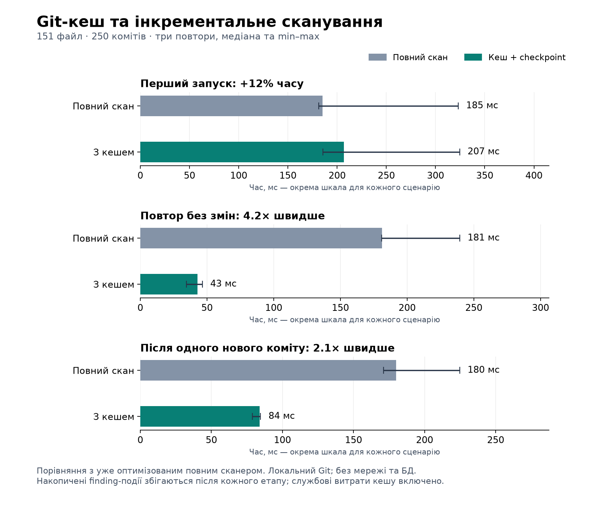

# Постійний Git-кеш та інкрементальне сканування

Реалізовано 21 вересня 2026. Порівняння з уже оптимізованим повним сканером із попереднього [звіту](2026-09-21-scan-performance.md), а не з початковим повільним варіантом.

| Сценарій | Повний скан, мс | Кеш + checkpoint, мс | Результат |
|---|---:|---:|---|
| Перший запуск | 185,09 | 206,76 | приблизно на 12% довше |
| Повтор без змін | 181,22 | 42,74 | 4,24× швидше |
| Один новий коміт | 180,03 | 83,93 | 2,15× швидше |



## Реалізована поведінка

1. `FsScanCacheAdapter` зберігає bare repo в `.scan-cache` під коренем робочих тек сканера та утримує OS-блокування `flock` до завершення запису findings і контрольної точки в БД. У межах одного процесу дубльовані запуски приєднуються до активного; між процесами конфлікт повертає помилку конкретному job і не перезаписує стан активного скану.
2. `syncBare` робить clone один раз, а потім fetch поточного remote HEAD. Він не покладається на refspec звичайного clone; оновлює detached HEAD і враховує зміну default branch. Недоступний remote дає помилку, а не результат зі старого кешу. Перерваний clone без маркера завершення створюється заново.
3. Контрольна точка — `last_commit_sha` разом із новим `scanner_version` у SQLite. Вона оновлюється лише після успішного `addFindings`. Після часткового запису/збою повтор відбувається від попередньої контрольної точки; наявне злиття findings прибирає дублікати.
4. Версія — SHA-256 коду domain, scan use-case та Git adapter разом з ідентичністю джерела. Після зміни правил/фільтрів/парсера потрібен повний скан. Після оновлення коду API треба перезапустити, щоб workers завантажили новий код.
5. Незмінний HEAD і та сама версія пропускають детекцію. Для нащадка попереднього HEAD читається лише `previous..HEAD`. За відсутності base або після переписування історії запускається повна перевірка доступної історії HEAD.
6. На новому HEAD перевіряються всі поточні файли. Це зберігає наявну логіку шляхів findings та обліку нових commit sightings навіть для незмінених файлів. Окремого дискового кешу значень findings не додано.
7. Кеші, не використані сім днів, прибираються під час наступних сканів, не частіше разу на годину на процес; активні блокування поважаються. Корінь створюється з правами `0700`. Дискового ліміту немає, lock-файли залишаються для збереження inode блокування.

Історична область покриття лишилася попередньою: HEAD та його предки, не всі гілки. Старі findings не видаляються після force-push. Кеш можна очистити, зупинивши всі API-процеси; SQLite findings при цьому зберігаються. Кеші на різних хостах не координуються: процеси повинні використовувати спільний абсолютний SCAN_WORKDIR на локальній файловій системі.

## Методика

Синтетичний репозиторій: 151 файл і 250 початкових комітів, потім один новий. Три окремі Node-процеси, порядок варіантів чергується. Фінальні заміри виконано після завершення тестів. Наведено медіани; графік показує також min–max.

Вимірюється реальний `RunScanJobUseCase` і Git adapter. Для кешованого варіанта враховано acquire/release блокування, fingerprint коду та очистку кешу. TypeScript startup, мережа, Redis, БД і Piscina не входять до часу. Checkpoint у benchmark імітується після успішного скану; правильність його запису окремо перевірена тестами use-case та Prisma.

Кількість подій одного інкрементального запуску закономірно менша: старі результати вже є в БД. Для кожного етапу benchmark порівнює SHA-256 **накопиченої множини повних finding-подій**, включно зі значенням, типом, контекстом, шляхом, рядком і commit. Відбитки збігаються в усіх запусках. Сирі значення у звіт не записуються. На реальних remote результати залежать від мережі, розміру історії та частки змінених файлів.

## Перевірки та запуск

- **53 suites, 365 тестів API пройшли**, включно з Git, Prisma, Piscina та BullMQ. Тимчасовий Redis після тестів видалено.
- TypeScript `--noEmit`, build API та `git diff --check` пройшли.
- Перевірено: незмінний HEAD; точну рівність нових finding-подій із повним сканом; нову версію детектора; force-push/default branch; збій fetch; перерваний clone; зміну джерела; блокування; TTL-очистку; помилку запису findings; передачу checkpoint через реальний worker.
- Рев'ю за `new-use-case`, `hex-architecture-reviewer`, `secret-handling-reviewer` та `lazy-simplifier`: використано наявні Git/DB порти й окремий порт життєвого циклу кешу; порушень шарів, нових витоків findings або зайвих абстракцій у зміненому коді не виявлено.
- Prisma Client згенеровано, міграцію `20260921120000_add_scan_checkpoint` застосовано до локальної `dev.db`. Дані findings не видалялися. Потрібен перезапуск уже запущеного API для завантаження нової збірки.
- Web не змінювався; тести та build Web у цій зміні не запускалися. Попередні зауваження щодо авторизації/UI не належать до цього виправлення.

Із `credsScrapper/`:

```sh
node scripts/benchmark-incremental.cjs ../docs/benchmarks/new-incremental.json
python3 scripts/plot-incremental-benchmark.py ../docs/benchmarks/new-incremental.json ../docs/benchmarks/new-incremental
```

Потрібні встановлені npm-залежності проєкту, Git, Linux `flock`, `/bin/sh`, `cat`; для графіка — Python із matplotlib. Залежності npm не змінювалися.

Артефакти: [JSON із сирими вимірами](2026-09-21-incremental-performance.json), [SVG](2026-09-21-incremental-performance.svg), [benchmark](../../credsScrapper/scripts/benchmark-incremental.cjs), [скрипт графіка](../../credsScrapper/scripts/plot-incremental-benchmark.py). Деталі роботи та оновлення — у [README](../../credsScrapper/README.md#persistent-and-incremental-scans).
