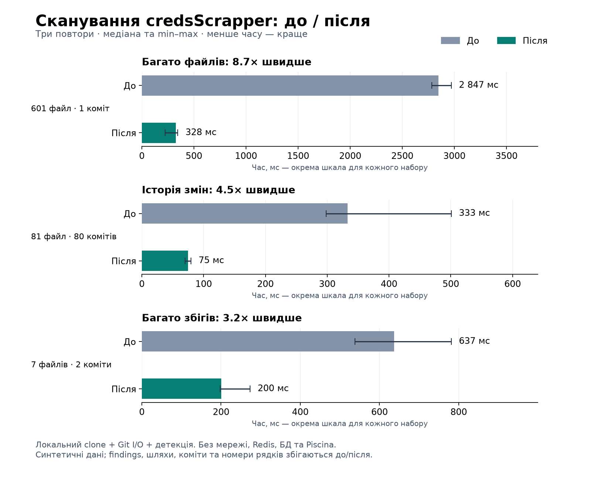
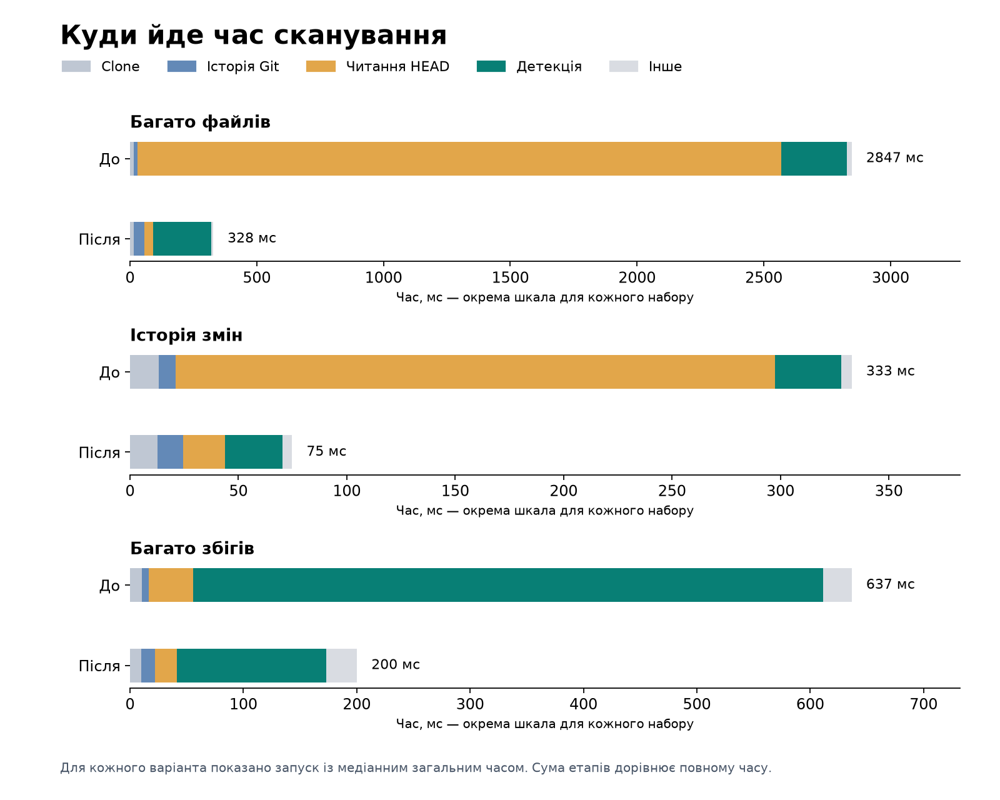

# Прискорення credsScrapper — 21 вересня 2026

Оновлення: наступним етапом реалізовано [постійний кеш та інкрементальні сканування](2026-09-21-incremental-performance.md). Нижче зафіксовано результати першого етапу.

Локальні синтетичні тести показали прискорення від 3,2× до 8,7× зі збереженням результатів виявлення. Це заміри виконання сканера, а не прогноз часу завантаження довільного репозиторію з GitHub.

| Сценарій | До, мс | Після, мс | Прискорення | Findings |
|---|---:|---:|---:|---:|
| 601 файл, 1 коміт | 2846,73 | 327,88 | 8,68× | 2 |
| 81 файл, 80 комітів | 332,88 | 74,76 | 4,45× | 80 |
| 7 файлів, 2 коміти, багато збігів | 636,61 | 200,18 | 3,18× | 23984 |



## Що змінилося

- Читання HEAD: один `git cat-file --batch` замість окремого `git show` на кожен файл. Запити використовують OID, тому пробіли, Unicode та переноси рядків у назвах не порушують протокол. Вікно запитів — 64 об'єкти.
- Історія: `git log` обробляється потоком, по одному коміту, замість завантаження всіх diff у пам'ять. Збережено попередню область обходу HEAD та формат diff, включно з CRLF. Це не сканування всіх гілок.
- Детектор: відсортовані інтервали та один прохід замість перевірки кожного entropy-кандидата проти кожного попереднього збігу. Складність саме перевірки перекриттів змінено з O(M×E) на O(M log M + E). Дешеву перевірку кількості цифр перенесено перед обчисленням ентропії; правила виявлення залишилися ті самі.
- Worker передає findings пакетами до 256 подій і чекає підтвердження. Фінальний маркер гарантує отримання подій перед завершенням; прибрано припущення, що одного `setImmediate` достатньо.
- Одночасні сканування одного repo об'єднуються в межах одного процесу API. Це захищає робочу теку від взаємного видалення. Помилка сканування тепер доходить до статусу job; виправлено гонку `maxRepos` та стан candidate після прямого запуску.

Головний виграш у сценарії з багатьма файлами — читання HEAD: медіана 2539 → 35 мс. У сценарії з багатьма збігами детекція займає 556 → 132 мс. Потокове читання короткої історії саме по собі в цих наборах трохи повільніше; його перевага — відсутність буферизації всієї історії.



## Чи можна обійтися без clone

Для **пошуку тільки в поточній версії** можна завантажити tar/zip-архів конкретного commit і читати його потоком. Це окремий режим: видалені раніше секрети він не покриває. GitHub надає архіви та Contents API; пофайловий Contents API додає мережеві запити й має обмеження розміру файлів та кількості записів каталогу. [Документація GitHub](https://docs.github.com/en/rest/repos/contents).

Для **історії та повторних сканувань** перспективний наступний крок — збережений bare-кеш і `git fetch`, сканування нових комітів та кеш результатів blob за OID і версією детектора. Потрібні блокування між процесами, політика очищення кешу, обробка force-push і повний перерахунок після зміни правил. У цій зміні постійний кеш та інкрементальний режим **не реалізовано**. [Документація git fetch](https://git-scm.com/docs/git-fetch).

`--filter=blob:none` не гарантує прискорення повної перевірки історії: пропущений вміст доведеться дозавантажувати, коли він потрібен детектору. Це висновок для нашого сценарію з механізму lazy fetching у [документації partial clone](https://git-scm.com/docs/partial-clone). Зараз збережено bare clone і оптимізовано читання через [git cat-file](https://git-scm.com/docs/git-cat-file).

## Методика та перевірки

- По три запуски кожного варіанта в окремих Node-процесах, порядок до/після чергується; у таблиці медіани, на графіку також min–max. Невелика кількість повторів і синтетичні набори обмежують узагальнення.
- Вимірюється реальний `RunScanJobUseCase`, Git adapter та детектор, включно з локальним clone. Мережа, Redis, БД, запуск Piscina та компіляція TypeScript не входять у час.
- SHA-256 послідовності повних finding-подій збігається для всіх шести запусків кожного набору: значення, тип, контекст, commit, шлях і рядок. Тестові дані синтетичні; у JSON збережені лише метрики та відбитки.
- Пройшли всі **52 suites / 354 тести API**, включно з інтеграційними тестами Git, Prisma, Piscina та BullMQ з окремим тимчасовим Redis. Redis після перевірки видалено. TypeScript `--noEmit` та build API також пройшли. Web у цій зміні не редагувався.
- Рев'ю за `hex-architecture-reviewer`, `secret-handling-reviewer`, `lazy-simplifier`: у зміненому коді порушень шарів, нових витоків секретів або зайвих абстракцій не виявлено. Це не закриває попередні зауваження до авторизації jobs чи UI з [початкового аналізу](../reviews/2026-09-21-credsScrapper.md).
- Обмеження: findings ще накопичуються перед записом у БД; один diff коміту буферизується (ліміт 512 MiB), файл — до 100 MiB. Об'єднання одночасних сканувань не є distributed lock. Мережевий clone великих репозиторіїв може залишатися основною витратою часу.

## Відтворення

З теки `credsScrapper/`, з установленими залежностями та Git:

```sh
node scripts/benchmark-scan.cjs /path/to/baseline/credsScrapper ../docs/benchmarks/new-results.json
python3 scripts/plot-scan-benchmark.py ../docs/benchmarks/new-results.json ../docs/benchmarks/new-results
```

Baseline має містити вихідний `apps/api/src`, `apps/api/tsconfig.json` та доступ до залежностей npm workspace (включно з залежностями `apps/api/node_modules`). Для графіків потрібен Python з matplotlib; залежності застосунку не змінювалися. Поточний baseline збережено тимчасово у `/tmp/creds-perf-before`; він не входить до репозиторію.

Артефакти: [сирі виміри JSON](2026-09-21-scan-performance.json), [векторний графік SVG](2026-09-21-scan-performance.svg), [скрипт benchmark](../../credsScrapper/scripts/benchmark-scan.cjs), [скрипт графіків](../../credsScrapper/scripts/plot-scan-benchmark.py).
