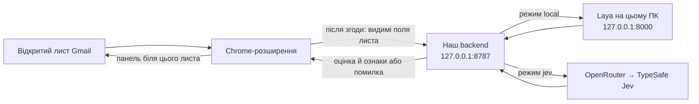

# Fishing Analizer

Прототип перевіряє **лише відкриті й розгорнуті** повідомлення Gmail. У ньому є три окремі частини:

```text
fishingAnalizer/
├── extection/       TypeScript код Chrome-розширення (назва теки за вашим запитом)
├── backend/         наш Node сервер аналізу, порт 8787
├── shared/          типи запитів, відповідей і спільні налаштування
├── localModel/      встановлена Laya, скрипти запуску й локальний кеш ваг
├── start-all.sh      одна команда для збірки й запуску обох серверів
├── dist/extection/ готове розширення для Chrome після npm run build
└── dist/backend/   готовий Node сервер після npm run build
```

У розширенні `dom.ts` читає відкритий лист, `controller.ts` керує згодою й актуальністю запиту, `panel.ts` показує стан, а `background.ts` звертається до бекенду. На сервері `http.ts` перевіряє запит, `analyze.ts` збирає ознаки й оцінку, `adapters.ts` викликає Jev або Laya. `index.ts` лише запускає сервер. Спільний формат даних і адреса сервера визначені в `shared/`.



**У налаштуваннях розширення завжди вказуйте `http://127.0.0.1:8787`.** Це адреса *нашого backend*. Порт `8000` використовує тільки backend для зв’язку з Laya; адресу Laya в розширення не вводять. Ключ OpenRouter зберігається лише в середовищі backend.

## Запуск

Потрібні Node.js 22.23+, npm, Chrome і Python 3.10+. З кореня `fishingAnalizer` виконайте:

```bash
./start-all.sh
```

Скрипт встановить відсутні npm-залежності, збере розширення й backend, за потреби встановить Laya та запустить обидва сервери. На комп’ютері з доступною NVIDIA GPU він автоматично встановить CUDA-збірку PyTorch і вибере GPU; без неї працюватиме на CPU. Якщо в системного Python немає заголовків `Python.h`, для CUDA потрібна команда `uv`: скрипт автоматично використає Python 3.13 з `uv` у власному віртуальному середовищі. Для примусового CPU запустіть `LAYA_DEVICE=cpu ./start-all.sh`, для обов’язкової CUDA — `LAYA_DEVICE=cuda ./start-all.sh`. Перший запуск завантажує ваги моделі з Hugging Face і може тривати кілька хвилин. Перед повідомленням про готовність скрипт перевіряє аналіз синтетичного листа. Залиште термінал відкритим. `Ctrl+C` зупинить процеси, які запустив скрипт. Якщо ці самі сервери вже працюють, скрипт використає їх без перезапуску; у такому разі для зупинки закрийте термінали, де ви їх запускали. Якщо порт `8787` зайнятий старішою версією backend, зупиніть її в старому терміналі й запустіть скрипт повторно.

У Chrome відкрийте `chrome://extensions`, увімкніть режим розробника, натисніть **Load unpacked** і виберіть **`fishingAnalizer/dist/extection`**. Нове встановлення вже має адресу backend `http://127.0.0.1:8787` та режим «Локальна Laya». Відкрийте розгорнутий лист у Gmail і підтвердьте передачу його вмісту локальному серверу. Якщо розширення було встановлено раніше, натисніть **Reload** на його картці й оновіть Gmail; раніше збережений режим Jev потрібно один раз змінити на «Локальна Laya» в налаштуваннях розширення.

Сторінка `extection/options.html`, відкрита як `file://`, не має доступу до `chrome.storage`, тому так її налаштовувати не можна.

### Окремий запуск для розробки

За потреби можна запускати частини окремо:

```bash
npm install
npm test
npm run build
npm start
```

`npm start` залиште працювати в терміналі: це backend на `127.0.0.1:8787`. Адреса `http://127.0.0.1:8787/` показує коротку інструкцію підключення, а `http://127.0.0.1:8787/health` повертає `{"ok":true,"service":"fishingAnalizer"}` для технічної перевірки. Інтерфейс перевірки листа з’являється у Gmail після встановлення Chrome-розширення.

### Режим «Локальна Laya»

Laya встановлюється в `localModel/.venv`, а ваги зберігаються в `localModel/.cache/huggingface`. У **другому терміналі**:

```bash
bash localModel/setup.sh
bash localModel/start.sh
```

`setup.sh` потрібен лише для першого встановлення. `start.sh` запускає Laya на `127.0.0.1:8000`; при першому запуску ваги завантажуються з Hugging Face. Для локального режиму одночасно мають працювати **два процеси**: `npm start` і `bash localModel/start.sh`. Для нього ключ OpenRouter не потрібний. Використано офіційний [Laya HTTP сервер](https://github.com/NandhaKishorM/laya#self-hosting-http-server-jev-compatible); [картка моделі](https://huggingface.co/convaiinnovations/laya-multilingual) описує її обмеження. Контекст локальної моделі — 1024 токени, а її ймовірності не відкалібровані для фішингових листів.

На цій машині встановлена NVIDIA RTX 5070 Ti Laptop GPU. Для зміни CPU на GPU спершу зупиніть уже запущену Laya, потім повторно виконайте `./start-all.sh`: він замінить CPU-збірку PyTorch на CUDA-збірку у власному `localModel/.venv`. Це завантажить додаткові пакети. Відповідь `/health` показує вибраний режим, але для підтвердження фактичного використання GPU перевірте пам’ять процесу через `nvidia-smi` під час аналізу.

### Режим «TypeSafe Jev»

Перед запуском backend задайте ключ у **його** середовищі:

```bash
export OPENROUTER_API_KEY='ваш_ключ'
npm start
```

Laya для цього режиму запускати не потрібно. Backend надсилає дані до [OpenRouter Decisions API](https://openrouter.ai/docs/api/api-reference/alphadecisions/submit-a-decisions-questions-and-answers-request), який викликає TypeSafe Jev. Ключ ніколи не потрапляє в Chrome-розширення.

## Як користуватися

Відкрийте лист у Gmail. Панель біля розгорнутого повідомлення пояснить, які поля та куди передаються, і попросить згоду **перед першим запитом**. Згода запам’ятовується для конкретної пари адреси backend і режиму: наступні відкриті листи перевіряються автоматично. Її можна відкликати в налаштуваннях розширення. Разом із згодою зберігається час натискання, а з відкликанням — час відкликання: це не дає запізнілому запису відновити відкликану згоду.

Станів оцінки три: «підозрілий», «потрібна перевірка», «явних ознак не знайдено». Біля оцінки показуються підтверджені ознаки з доступних полів, наприклад різні домени відправника й посилання. Висновок не гарантує безпеку. Якщо backend або модель недоступні, панель показує помилку **без вигаданого вердикту**. Тестові приклади листів є в [`fixtures/messages.json`](fixtures/messages.json).

`npm test` запускає перевірку TypeScript, збірку й тести DOM, перемикання повідомлень, згоди, уникнення повторних запитів і відповіді backend. Збірка генерує `dist/`; цей каталог, Python `.venv` і кеш ваг не потрапляють до Git.

## Перевірка Laya на відкритих корпусах

Для відтворення оцінки запустіть `./start-all.sh`, а в іншому терміналі:

```bash
python3 scripts/evaluate_local.py --download --all > /tmp/fishing-laya-evaluation.json
```

Скрипт бере всі придатні унікальні листи з [Nazario 2022–2025](https://monkey.org/~jose/phishing/) (позначені автором як phishing) та [SpamAssassin easy/hard ham](https://spamassassin.apache.org/old/publiccorpus/readme.html). Тексти корпусів завантажуються лише в `/tmp/fishing-eval-data` й не додаються до Git. Вивід містить тільки агреговані кількості, час відповіді, хеші корпусів і ревізію ваг; жодне посилання з листа не відкривається. Видаліть тимчасові корпуси вручну, коли вони більше не потрібні. Перевірка кількох тисяч листів на CPU може тривати десятки хвилин.

Режим `core` (за замовчуванням) використовує справжню функцію аналізу backend і одним запитом до локальної Laya отримує обидва результати: початковий вибір моделі та підсумок після серверних правил. Для окремої перевірки HTTP-інтеграції доступний `--transport http`; він робить два запити на лист і працює повільніше. `--per-source 30` замість `--all` дає малий пілот. Це перевірка сирих публічних листів після наближеного перетворення до видимих полів Gmail, а не перевірка роботи Gmail DOM на реальних сторінках. Мітки корпусів можуть містити помилки; старий ham і новіший phishing створюють зміщення. Статус `review` означає потребу ручної перевірки, а не вдале виявлення. Результати CPU, GPU і таблиці за джерелами є в [звіті бенчмарка](docs/local-model-evaluation.md).

## Обмеження

Gmail може змінити DOM-класи, і тоді доведеться оновити селектори в `extection/dom.ts`. Розширення читає тільки видимі розгорнуті листи: приховані цитати, вміст вкладень, заголовки SPF/DKIM, репутація доменів і вся скринька не перевіряються. Посилання не відкриваються. Текст листа не записується в лог чи на диск; у пам’яті розширення зберігаються лише хеш і результат на час роботи вкладки.

Окрема [пропозиція темного дизайну розширення](extection/DESIGN.md) ще не реалізована в інтерфейсі.
